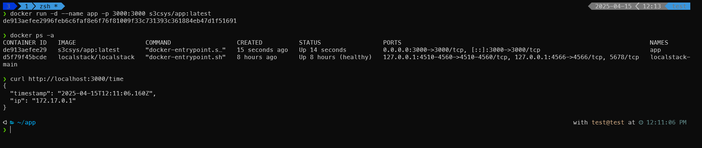

# 🛠️ JSON Server with Docker & AWS ECS Setup

This project demonstrates a simple Node.js server that returns the server's IP and the current time in JSON format. The server is containerized using Docker and can be deployed to AWS ECS using Fargate.

---

## 📁 Project Structure

```
SimpleTimeService/app
├── Dockerfile
├── README.md
├── db.json
├── docker.png
├── package.json
└── time.js
```

---


## 🚀 Features

- `/` endpoint: Returns HTTP 200 OK (used for ECS health check).
- `/time` endpoint: Returns current server time and IP in JSON format.
- Dockerized for easy deployment.
- ECS-ready setup.

## ⚙️ How to Use

### 1. Clone the Repo

```bash

https://github.com/s3csys/SimpleTimeService.git
cd SimpleTimeService
```

### Build the Docker Image

```bash
docker build --pull --rm -f 'Dockerfile' -t 's3csys/app:latest' 'app'
```

### Run the Container

```bash
docker run -d --name app -p 3000:3000 s3csys/app:latest
```

### Check the conatiner 

```bash
docker ps -a
```

Now, open your browser or use `curl`:

```bash
curl http://$IP$:3000/time
```

Output:

```bash
{
  "timestamp": "<current date and time>",
  "ip": "<the IP address of the visitor>"
}
```

