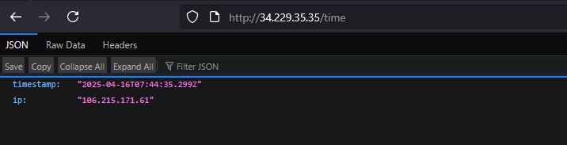

# Terraform Project: ECS Cluster with ALB

## Overview

This Terraform project provisions the following infrastructure on AWS:
- A VPC with 2 public and 2 private subnets.
- An ECS cluster deployed in the private subnets.
- An ECS service running a containerized application.
- An Application Load Balancer (ALB) in the public subnets to expose the service.

## Prerequisites

- [Install Terraform](https://secsys.pages.dev/posts/terraform/#-installing-terraform-on-linux): Ensure Terraform is installed on your machine. Run:

```bash
terraform --version
```

- AWS CLI: Install and configure the AWS CLI with credentials:

```bash
aws configure
```

> **ℹ️ Info:** Ensure proper IAM permissions are configured for your AWS credentials.

- Git: Install Git to manage your repository:

```bash
git --version
```

- S3 Bucket Example (Optional):

```bash
aws s3api create-bucket \
  --bucket terraform-state-secsys-bucket \
  --region us-east-1
```

- DynamoDB Table (for Locking Optional):

```bash
aws dynamodb create-table \
  --table-name terraform-locks \
  --attribute-definitions AttributeName=LockID,AttributeType=S \
  --key-schema AttributeName=LockID,KeyType=HASH \
  --provisioned-throughput ReadCapacityUnits=5,WriteCapacityUnits=5
```

- Create an S3 bucket for Terraform state (optional): If using remote state storage, ensure an S3 bucket is created.

## 📁 Project Structure

```
SimpleTimeService/terraform
├── LICENSE
├── README.md
├── backend.tf
├── cloud.png
├── main.tf 	         # Main Terraform configuration
├── terraform.tfvars   # Values for input variables
└── variables.tf 	     # Input variables for the project
```

## Setup Instructions

### Step 1: Clone Repository

Clone this repository to your local machine:

```bash
git clone https://github.com/s3csys/cloud.git
cd cloud
```

### Step 2: Initialize Terraform

Run the following command to initialize the working directory:

```bash
terraform init
```

This will:

- Download necessary provider plugins.
- Set up backend configuration (if using remote state).

### Step 3: Format and Validate Configuration

Format your $FILE.tf files for consistency:

```bash
terraform fmt
```

Validate the configuration syntax:

```bash
terraform validate
```

### Step 4: Plan Infrastructure Changes

Generate an execution plan to preview changes:

```bash
terraform plan --out="tfplan"
```

### Step 5: Apply Configuration

Apply the changes to provision infrastructure:

```bash
terraform apply "tfplan"
```

### Step 6: Verify Infrastructure

Once applied successfully, verify resources in the AWS Management Console:

- VPC → Subnets → Route Tables.
- ECS → Cluster → Services → Tasks.
- EC2 → Load Balancers.

### Step 7: Destroy Infrastructure

- To clean up and delete all resources, run:

```bash
terraform destroy
```

- Delete the objects from S3

```bash
aws s3 rm s3://terraform-state-bucket --recursive
aws s3api delete-bucket --bucket your-terraform-state-bucket --region us-east-1
```

- Delete the DynamoDB table

```bash
aws dynamodb delete-table --table-name terraform-locks --region us-east-1
```

- Optional: Remove local Terraform config cache

```bash
rm -rf .terraform terraform.tfstate terraform.tfstate.backup

OR 

terraform init -reconfigure
```


